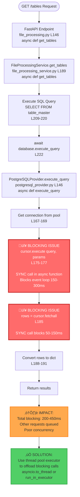
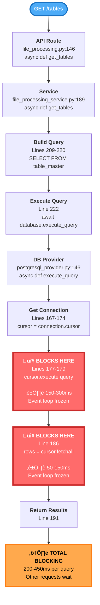

# Issue 1: Blocking I/O

```mermaid
flowchart TB
    Start([GET /tables Request]) --> API[FastAPI Endpoint<br/>file_processing.py L146<br/>async def get_tables]
    
    API --> Service[FileProcessingService.get_tables<br/>file_processing_service.py L189<br/>async def get_tables]
    
    Service --> Query1[Execute SQL Query<br/>SELECT FROM table_master<br/>L209-220]
    
    Query1 --> ExecuteQuery[await database.execute_query<br/>L222]
    
    ExecuteQuery --> Provider[PostgreSQLProvider.execute_query<br/>postgresql_provider.py L146<br/>async def execute_query]
    
    Provider --> GetConn[Get connection from pool<br/>L167-169]
    
    GetConn --> Problem[🔴 BLOCKING ISSUE<br/>cursor.execute query, params<br/>L175-177<br/><br/>SYNC call in async function<br/>Blocks event loop 150-300ms]
    
    Problem --> Fetch[🔴 BLOCKING ISSUE<br/>rows = cursor.fetchall<br/>L185<br/><br/>SYNC call blocks 50-150ms]
    
    Fetch --> Convert[Convert rows to dict<br/>L188-191]
    
    Convert --> Return[Return results]
    
    Return --> Impact[⚠️ IMPACT:<br/>Total blocking: 200-450ms<br/>Other requests queued<br/>Poor concurrency]
    
    Impact --> Solution[‚úÖ SOLUTION:<br/>Use thread pool executor<br/>to offload blocking calls<br/>asyncio.to_thread or<br/>run_in_executor]
    
    style Problem fill:#ff6b6b,stroke:#c92a2a,stroke-width:3px,color:#fff
    style Fetch fill:#ff6b6b,stroke:#c92a2a,stroke-width:3px,color:#fff
    style Impact fill:#ffa94d,stroke:#fd7e14,stroke-width:2px
    style Solution fill:#51cf66,stroke:#2f9e44,stroke-width:2px
```

# Issue 1: Blocking I/O

```mermaid
flowchart TD
    Start([<b>GET /tables</b>])
    
    Start --> API[<b>API Route</b><br/>file_processing.py:146<br/>async def get_tables]
    
    API --> Service[<b>Service</b><br/>file_processing_service.py:189<br/>async def get_tables]
    
    Service --> BuildQuery[<b>Build Query</b><br/>Lines 209-220<br/>SELECT FROM table_master]
    
    BuildQuery --> Execute[<b>Execute Query</b><br/>Line 222<br/>await database.execute_query]
    
    Execute --> Provider[<b>DB Provider</b><br/>postgresql_provider.py:146<br/>async def execute_query]
    
    Provider --> GetConn[<b>Get Connection</b><br/>Lines 167-174<br/>cursor = connection.cursor]
    
    GetConn --> Block1[<b>🔴 BLOCKS HERE</b><br/>Lines 177-179<br/>cursor.execute query<br/><br/>⏱️ 150-300ms<br/>Event loop frozen]
    
    Block1 --> Block2[<b>🔴 BLOCKS HERE</b><br/>Line 186<br/>rows = cursor.fetchall<br/><br/>⏱️ 50-150ms<br/>Event loop frozen]
    
    Block2 --> Return[<b>Return Results</b><br/>Line 191]
    
    Return --> Impact[<b>⚠️ TOTAL BLOCKING</b><br/>200-450ms per query<br/>Other requests wait]
    
    style Block1 fill:#ff6b6b,stroke:#c92a2a,stroke-width:4px,color:#fff,font-size:16px
    style Block2 fill:#ff6b6b,stroke:#c92a2a,stroke-width:4px,color:#fff,font-size:16px
    style Impact fill:#ffa94d,stroke:#fd7e14,stroke-width:3px,color:#000,font-size:16px
    style Start fill:#4dabf7,stroke:#1971c2,stroke-width:3px,color:#fff,font-size:16px
```

