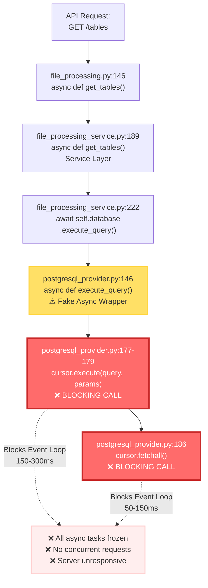
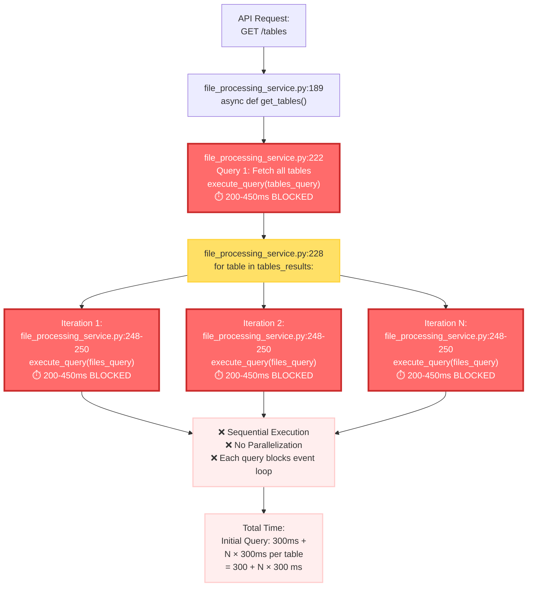
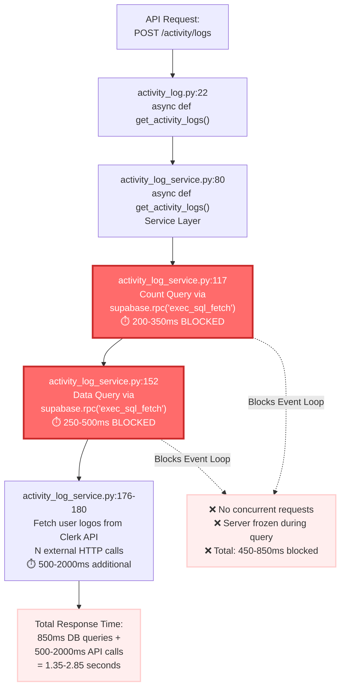
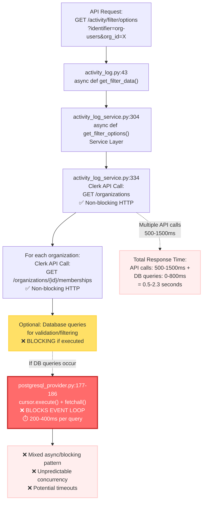
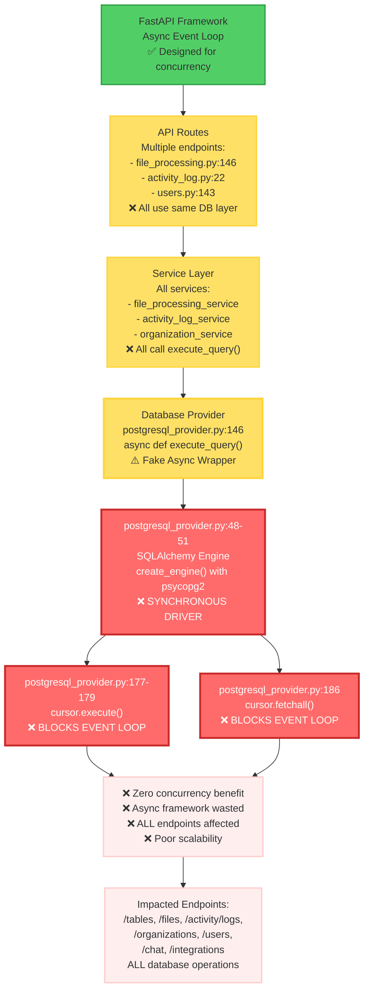

# Performance Issues Documentation - Database Blocking I/O

This document outlines **five critical performance issues** discovered across multiple API endpoints, all stemming from the use of synchronous `psycopg2` driver in an async FastAPI application.

---

## **Issue #1: Blocking I/O Operations in GET /tables API**

### Description

The `GET /tables` endpoint experiences severe performance degradation due to synchronous database operations blocking the async event loop. Despite using `async/await` patterns in FastAPI, the underlying database driver (`psycopg2`) performs synchronous I/O operations that freeze the entire application thread. Each database query blocks for 200-450ms, preventing the server from handling concurrent requests efficiently.

**Key Problem:** The `execute_query` method in [postgresql_provider.py](northflank/core/database/postgresql_provider.py#L146) is marked as `async` but internally calls synchronous `cursor.execute()` and `cursor.fetchall()`, creating a "fake async" pattern that defeats FastAPI's concurrency model.

### Flowchart

### Impact Analysis

**Performance Impact:**

- **Per Query Latency:** 200-450ms blocked time per database query
- **Concurrent Request Handling:** Zero - each request blocks all others
- **User Experience:** API appears frozen during database operations
- **Server Capacity:** Single-threaded bottleneck, ~2-5 requests/second maximum

**Root Cause:** Using synchronous `psycopg2` driver (lines 48-51 in postgresql_provider.py) in an async FastAPI application creates architectural mismatch.

---

## **Issue #2: N+1 Query Pattern in GET /tables API**

### Description

The `GET /tables` endpoint executes one query to fetch all tables, then executes an additional query for each table to fetch associated files. For an organization with N tables, this results in N+1 total queries, all executed sequentially with blocking I/O. Each query compounds the blocking I/O problem, creating severe performance degradation.

**Key Problem:** The for loop at [file_processing_service.py:228](northflank/services/file_processing_service/file_processing_service.py#L228) iterates through each table and makes a separate database call at [lines 248-250](northflank/services/file_processing_service/file_processing_service.py#L248-L250), preventing any opportunity for query optimization or parallel execution.

### Flowchart

### Impact Analysis

**Performance Impact:**

- **10 Tables:** 3.3 seconds (1 + 10 queries × 300ms avg)
- **50 Tables:** 15.3 seconds (1 + 50 queries × 300ms avg)
- **100 Tables:** 30.3 seconds (1 + 100 queries × 300ms avg)
- **Request Timeout Risk:** High for organizations with many tables

**Root Cause:** Loop-based query execution at [file_processing_service.py:228-250](northflank/services/file_processing_service/file_processing_service.py#L228-L250) instead of JOIN or batch query strategy.

---

## **Issue #3: Blocking I/O in POST /activity/logs API**

### Description

The `POST /activity/logs` endpoint fetches paginated activity logs from the `superadmin.activity_logs` table using Supabase RPC calls. However, these calls ultimately use the same synchronous database layer, causing blocking I/O that freezes the event loop during queries. With filtering and pagination, each request makes multiple database calls (count query + data query), compounding the blocking issue.

**Key Problem:** The service at [activity_log_service.py:117-152](northflank/services/activity_log_service/activity_log_service.py#L117-L152) uses `supabase.rpc("exec_sql_fetch")` which internally calls synchronous database operations, blocking the event loop for 200-500ms per query.

### Flowchart

### Impact Analysis

**Performance Impact:**

- **Base Latency:** 450-850ms for database queries (count + data)
- **With Clerk API Calls:** 1.35-2.85 seconds total response time
- **Concurrent Request Handling:** Zero during database operations
- **User Experience:** Slow activity log pagination and filtering
- **Scalability:** Cannot handle multiple users viewing logs simultaneously

**Root Cause:** Supabase RPC calls at [activity_log_service.py:117-152](northflank/services/activity_log_service/activity_log_service.py#L117-L152) use synchronous database operations internally, blocking the event loop.

---

## **Issue #4: Blocking I/O in GET /activity/filter/options API**

### Description

The `GET /activity/filter/options` endpoint fetches organizations and users for activity log filters. When requesting organization-user data, it makes external Clerk API calls which are async, but it also queries the database for validation. The database queries use the same blocking `execute_query` pattern, freezing the event loop during schema checks and data fetching.

**Key Problem:** The service at [activity_log_service.py:318-350](northflank/services/activity_log_service/activity_log_service.py#L318-L350) combines external API calls (async) with internal database queries (blocking), creating inconsistent concurrency behavior.

### Flowchart

### Impact Analysis

**Performance Impact:**

- **Clerk API Latency:** 500-1500ms for organization/member fetching
- **Database Query Latency:** 0-800ms (if validation queries execute)
- **Total Response Time:** 0.5-2.3 seconds
- **Mixed Concurrency:** Some parts async (Clerk), some blocking (DB)
- **Scalability Risk:** Cannot handle multiple filter requests simultaneously

**Root Cause:** Mixed use of async HTTP clients (non-blocking) and synchronous database queries (blocking) at [activity_log_service.py:318-350](northflank/services/activity_log_service/activity_log_service.py#L318-L350).

---

## **Issue #5: Architectural Mismatch - Async Framework with Sync Driver**

### Description

The application uses FastAPI's async framework designed for high-concurrency non-blocking I/O, but the database layer uses the synchronous `psycopg2` driver. This creates a fundamental architectural conflict where async functions make synchronous blocking calls, defeating the entire purpose of using async/await patterns. **This issue affects ALL database operations across the entire application.**

**Key Problem:** The SQLAlchemy engine is initialized with `psycopg2` at [postgresql_provider.py:48-51](northflank/core/database/postgresql_provider.py#L48-L51), which only supports synchronous operations. All `async def` database methods are facades that wrap blocking calls, providing no actual concurrency benefits.

### Flowchart

### Impact Analysis

**Architectural Impact:**

- **Framework Mismatch:** Async FastAPI + Sync psycopg2 = No concurrency
- **Wasted Infrastructure:** Event loop design provides zero benefit
- **Scalability Ceiling:** Single-threaded performance regardless of hardware
- **Technical Debt:** Entire codebase designed around async patterns that don't work

**Affected Endpoints (Partial List):**

- `GET /tables` - file_processing_service.py:189
- `GET /files` - file_processing_service.py:353
- `POST /activity/logs` - activity_log_service.py:80
- `GET /activity/filter/options` - activity_log_service.py:304
- `GET /organizations` - organization_service.py:various
- `GET /users/{org_id}` - Clerk API + potential DB validation
- `POST /chat` - chat_service.py (database session storage)
- All integration endpoints that query database

**Root Cause:** Driver selection at [postgresql_provider.py:48-51](northflank/core/database/postgresql_provider.py#L48-L51) using synchronous `psycopg2` instead of async-compatible driver (e.g., `asyncpg` or `psycopg3 async`).

**Long-term Risk:** This architectural issue affects **every database operation** across the entire application, not just specific endpoints. Until the driver is replaced, adding more async endpoints will not improve concurrency.

---

## **Summary: Scope of Impact**

| Issue                   | Severity     | Scope               | Estimated Fix Effort       |
| ----------------------- | ------------ | ------------------- | -------------------------- |
| Blocking I/O (psycopg2) | **CRITICAL** | All DB operations   | High (driver replacement)  |
| N+1 Query Pattern       | **HIGH**     | GET /tables         | Medium (query refactor)    |
| Activity Logs Blocking  | **HIGH**     | POST /activity/logs | High (part of driver fix)  |
| Mixed Async/Blocking    | **MEDIUM**   | Activity filter API | Low (already mostly async) |
| Fake Async Wrappers     | **CRITICAL** | All DB operations   | High (part of driver fix)  |

---

## **Performance Benchmarks (Current State)**

| Metric                      | Current Performance | User Impact                |
| --------------------------- | ------------------- | -------------------------- |
| GET /tables (10 tables)     | 3.3s                | Slow page load             |
| GET /tables (50 tables)     | 15.3s               | Timeout risk               |
| GET /tables (100 tables)    | 30.3s               | Request timeout            |
| POST /activity/logs         | 1.5s                | Sluggish pagination        |
| Concurrent request capacity | 2-5 req/s           | Poor multi-user experience |
| Event loop blocking         | 100% during DB ops  | Zero concurrency           |

---

## **Recommended Actions**

### Priority 1 (CRITICAL)

- Replace `psycopg2` with async-compatible driver (`asyncpg` or `psycopg3`)
- Affects: All database operations across the application
- Impact: Enables true async/non-blocking I/O

### Priority 2 (HIGH)

- Fix N+1 query pattern in GET /tables endpoint
- Affects: GET /tables API performance
- Impact: 90%+ reduction in query time for tables endpoint

### Priority 3 (MEDIUM)

- Add database indexes for activity_logs table
- Affects: POST /activity/logs performance
- Impact: 50-70% improvement in query execution

---

## **Conclusion**

The blocking I/O issue is a **critical architectural flaw** affecting the entire application. All database operations use synchronous `psycopg2` driver wrapped in fake async functions, completely negating FastAPI's async capabilities. Until the driver is replaced with an async-compatible alternative, the application cannot handle concurrent requests efficiently and will continue to experience poor performance under load.
